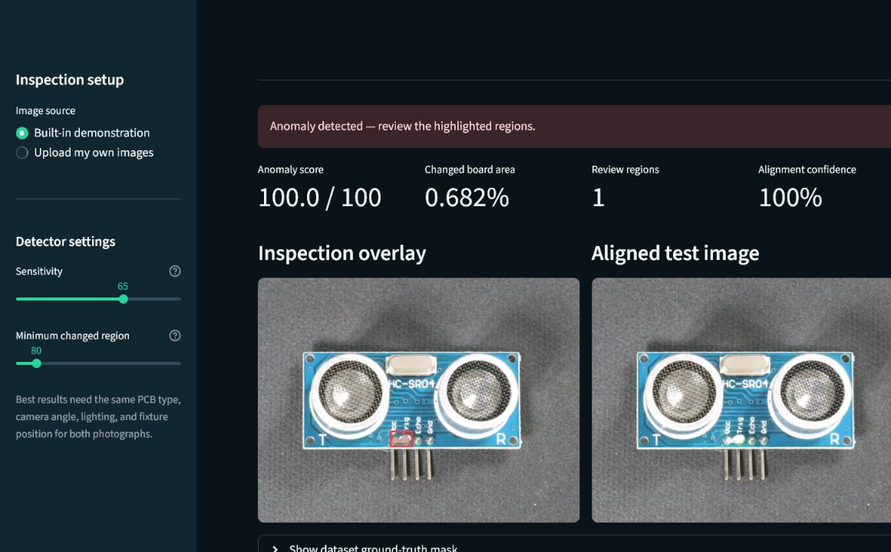
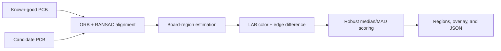

<div align="center">

# PCB Visual Inspector

**A reproducible, local-first visual anomaly detector for controlled PCB inspection.**

[](https://github.com/rezafarjad/industrial-pcb-anomaly-detection/actions/workflows/ci.yml)


</div>



The application aligns a PCB photograph with a known-good reference, measures
robust color and edge changes, and returns review regions, an annotated image,
and a machine-readable report. It runs without a trained model and keeps images
on the local machine.

This repository also contains a clearly separated, optional PatchCore research
notebook. The web application does not depend on ungenerated model files.

## Highlights

- Interactive Streamlit workflow with three attributed, verifiable examples.
- ORB feature matching and RANSAC homography for geometric alignment.
- Robust LAB color and edge-change scoring inside an estimated board region.
- Downloadable JSON report, aligned image, binary mask, and inspection overlay.
- Scriptable `pcb-inspect` command for repeatable batch or CI workflows.
- One-click Windows launcher, Docker image, and Compose configuration.
- Cross-platform tests on Windows and Linux, package build, app health check,
  and container build in CI.
- Honest validation artifacts: paired-example results are labeled as smoke
  validation, not a production benchmark.

## Choose the right path

| Path | Purpose | Training required | Status |
| --- | --- | --- | --- |
| Reference inspector | Controlled station with a known-good board image | No | Runnable and tested |
| PatchCore notebook | Research on VisA PCB categories with learned feature memory | Yes | Optional experiment |

The reference inspector is the productized path in this repository. The
notebook is documented in
[`docs/PATCHCORE_RESEARCH.md`](docs/PATCHCORE_RESEARCH.md).

## Quick start

### Windows: one click

1. Download or clone the repository.
2. Double-click **`Start PCB Inspector.bat`**.
3. Wait for the first-run environment installation.
4. The app opens in your browser automatically.

Double-click **`Create Desktop Shortcut.bat`** once if you want a permanent
desktop launcher. Later launches reuse the installed environment.

Python 3.10–3.12 is required. Keep the launcher window open while using the
local app.

### Terminal

```bash
git clone https://github.com/rezafarjad/industrial-pcb-anomaly-detection.git
cd industrial-pcb-anomaly-detection
python -m venv .venv
python -m pip install -e .
python -m streamlit run streamlit_app.py
```

Open <http://localhost:8501> if the browser does not open automatically.

### Docker

```bash
docker compose up --build
```

Then open <http://localhost:8501>. The container runs the app as an
unprivileged user and exposes a health check.

## Command-line inspection

Install the package, then provide a reference and a candidate image:

```bash
pcb-inspect \
  assets/samples/pcb1/reference.jpg \
  assets/samples/pcb1/defective.jpg \
  --output-dir inspection-output
```

Windows PowerShell can use the same command on one line.

The output directory contains:

```text
inspection-output/
|-- aligned_candidate.png
|-- anomaly_mask.png
|-- overlay.png
`-- report.json
```

Useful options:

```text
--sensitivity 0-100
--min-region-area PIXELS
--working-width PIXELS
```

You can also run the CLI as `python -m pcb_anomaly`.

## How it works



The detector normalizes moderate lighting variation, combines perceptual color
distance with gradient disagreement, and filters connected regions below the
configured area threshold. See
[`docs/ARCHITECTURE.md`](docs/ARCHITECTURE.md) for implementation details,
failure behavior, and trust boundaries.

## Bundled validation

The included samples are paired demonstrations derived from genuine VisA
anomalous images and masks. Each reference was reconstructed by inpainting the
annotated region, which makes the localization result deterministic and
inspectable. This derivation is disclosed in
[`assets/samples/manifest.json`](assets/samples/manifest.json).

Current smoke-validation results:

| Category | Control decision | Defect decision | Mask IoU | Precision | Recall |
| --- | --- | --- | ---: | ---: | ---: |
| PCB1 | No significant change | Anomaly detected | 0.558 | 0.601 | 0.887 |
| PCB2 | No significant change | Anomaly detected | 0.526 | 0.526 | 1.000 |
| PCB3 | No significant change | Anomaly detected | 0.440 | 0.489 | 0.814 |

Reproduce the report and overlays:

```bash
python scripts/validate_samples.py
```

These three paired examples verify application wiring and localization. They do
not establish production false-negative rates or full-dataset performance. See
[`docs/VALIDATION.md`](docs/VALIDATION.md) for the acceptance criteria and a
production validation checklist.

## Use your own PCB images

1. Select **Upload my own images** in the sidebar.
2. Upload a genuine known-good image of the board type.
3. Upload the candidate board.
4. Keep the camera, fixture, pose, focus, exposure, and lighting consistent.
5. Calibrate sensitivity on held-out examples from the actual station.

Low alignment confidence, large pose changes, glare, occlusion, or normal
manufacturing variation should trigger human review.

## Development

```bash
python -m pip install -e ".[dev]"
python scripts/check_project.py
ruff check .
pytest -q
python -m build
python scripts/smoke_app.py
```

Continuous integration repeats validation, linting, tests, package building,
and the Streamlit health check on both Ubuntu and Windows, then builds the
runtime Docker image.

## Repository map

```text
.
|-- pcb_anomaly/          # detector, metrics, sample metadata, and CLI
|-- assets/samples/       # attributed paired VisA demonstrations
|-- docs/                 # architecture, validation, and research notes
|-- notebooks/            # optional PatchCore research notebook
|-- results/              # reproducible smoke report and overlays
|-- scripts/              # launch, validation, and health-check tools
|-- tests/                # behavior, CLI, metric, and contract tests
|-- streamlit_app.py      # interactive application
|-- Dockerfile
`-- pyproject.toml
```

## Documentation and project policies

- [Architecture](docs/ARCHITECTURE.md)
- [Validation methodology](docs/VALIDATION.md)
- [PatchCore research path](docs/PATCHCORE_RESEARCH.md)
- [Contributing](CONTRIBUTING.md)
- [Security policy](SECURITY.md)
- [Support](SUPPORT.md)
- [Changelog](CHANGELOG.md)
- [Third-party notices](THIRD_PARTY_NOTICES.md)

## Data attribution

The bundled demonstration data is derived from the
[Visual Anomaly (VisA) dataset](https://github.com/amazon-science/spot-diff),
released under CC BY 4.0. Exact dataset rows and transformations are recorded
in the sample manifest and `THIRD_PARTY_NOTICES.md`.

## Limitations

- The runtime detector expects the same PCB design in both images.
- Reflections, lighting drift, viewpoint changes, and occlusion can produce
  false positives or hide defects.
- Thresholds must be calibrated for each real camera and production process.
- This is a decision-support demonstrator, not a certified autonomous
  quality-control system.

## Licensing status

No open-source license has been selected for the original source code yet.
Public visibility does not grant reuse rights by itself. The bundled VisA
derivatives remain subject to their separate CC BY 4.0 terms.
