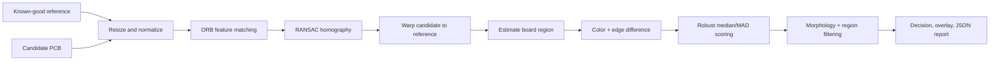

# Architecture

## Runtime inspection path

The runtime detector is implemented in
`pcb_anomaly/reference_detector.py`. It is model-free and deterministic for a
given pair of images and settings.

## Components

| Component | Responsibility |
| --- | --- |
| `streamlit_app.py` | Interactive image selection, settings, visualization, and downloads |
| `pcb_anomaly/reference_detector.py` | Alignment, board masking, anomaly scoring, and localization |
| `pcb_anomaly/cli.py` | Repeatable non-interactive inspection and artifact export |
| `pcb_anomaly/samples.py` | Bundled demonstration metadata and integrity checks |
| `scripts/validate_samples.py` | Reproducible paired-sample smoke validation |
| `scripts/smoke_app.py` | Starts the web app, probes its health endpoint, and shuts it down |
| `notebooks/` | Optional PatchCore research experiment; not part of runtime inference |

## Detection stages

1. **Input normalization** converts PIL or NumPy inputs to contiguous RGB
   arrays and limits the working width.
2. **Registration** detects ORB keypoints, applies a ratio test, estimates a
   homography with RANSAC, and rejects implausible transforms.
3. **Region estimation** identifies the board relative to border color and
   combines it with the valid warped-image mask.
4. **Photometric normalization** adjusts moderate per-channel location and
   spread differences inside the board region.
5. **Change measurement** combines blurred LAB color distance and local gradient
   disagreement.
6. **Robust scoring** expresses change relative to the median and median
   absolute deviation of the board.
7. **Region filtering** removes small isolated responses and produces review
   boxes, an anomaly-area percentage, and a 0–100 score.

## Failure behavior

If feature-based registration cannot produce a valid homography, the detector
uses a documented resize fallback and reports zero alignment confidence. The
app still produces a result, but operators should treat low-confidence
alignment as a reason for manual review.

## Trust boundaries

- Uploaded images are untrusted inputs. Pillow and OpenCV decode them in the
  application process.
- The local Streamlit server has no built-in authentication.
- The Docker image runs as an unprivileged user, but deployment-level
  authentication, TLS, size limits, and logging remain operator
  responsibilities.
- The optional notebook downloads third-party data and pretrained backbone
  weights; it should run in an isolated research environment.
